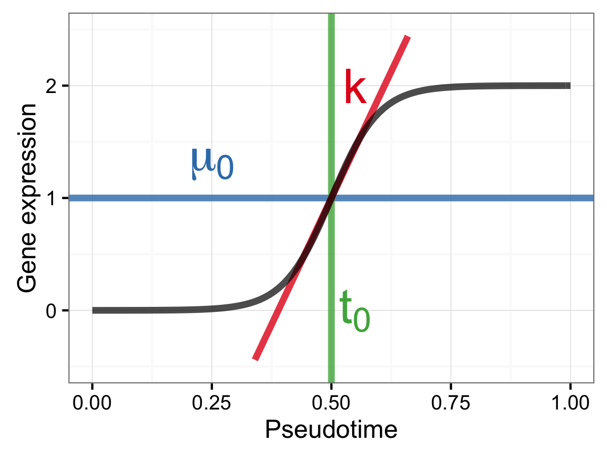
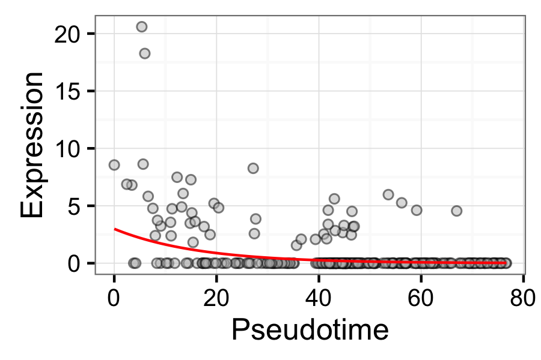

# switchde

Inference of switch-like differential expression along single-cell trajectories

## Installation

`switchde` is available on both Bioconductor and Github.

### Installation from Bioconductor

```r
source("https://bioconductor.org/biocLite.R")
biocLite("switchde")
```

### Installation from Github using Devtools

```r
# install.packages("devtools") # if devtools not already installed
devtools::install_github("kieranrcampbell/switchde")
```

## Introduction

`switchde` is an `R` package for detecting switch-like differential expression along single-cell RNA-seq trajectories. It assumes genes follow a sigmoidal pattern of gene expression and tests for differential expression using a likelihood ratio test. It also returns maximum likelihood estimates (MLE) for the sigmoid parameters, which allows filtering of genes for up or down regulation as well as where along the trajectory the regulation occurs.

The parametric form of gene expression assumed is sigmoidal:



Governed by three parameters:

* `mu_0` The half-peak expression
* `k` The 'activation strength'. If positive, the gene is upregulated along the trajectory; if negative, the gene is downregulated. The magnitude of `k` corresponds to how fast the gene is up or down regulated.
* `t_0` The 'activation time', or where in the trajectory this behaviour occurs. Note this parameter should be interpreted with respect to the overall range of the pseudotimes supplied.

## Usage

`switchde` accepts either an `SCESet` from [Scater](http://www.github.com/davismcc/scater) or a matrix of gene expression measurents. These should ideally be in `log(TPM + 1)` form, but any logged non-negative expression measurements will work.

We begin with an `SCESet` called `sce`, or equivalently a gene-by-cell expression matrix `X = exprs(sce)`. We also require a pseudotime vector `pseudotime`. Then call

```r
sde <- switchde(sce, pseudotime)
```

or equivalently 

```r
sde <- switchde(X, pseudotime)
```

This outputs a `data.frame` with six columns:

```r
sde


# Source: local data frame [5,000 x 6]
# 
#                  gene         pval         qval          mu0             k        t0
#                 <chr>        <dbl>        <dbl>        <dbl>         <dbl>     <dbl>
# 1   ENSG00000225976.4 1.393383e-22 1.024546e-20 104.86694912  -0.061517122 -68.87160
# 2  ENSG00000126522.12 2.185632e-01 6.067830e-01   1.22577161  -0.018819499  45.04442
# 3   ENSG00000239917.3 9.300623e-01 1.000000e+00   0.07908401   0.013177035  45.04440
# 4  ENSG00000151413.12 8.434079e-01 1.000000e+00   1.54634312  -0.005008349  45.04431
# 5   ENSG00000163814.3 6.217089e-02 2.634360e-01   0.18162897  -0.151326785  47.80757
# 6  ENSG00000197472.10 5.324570e-05 6.969332e-04   0.46516141 -45.928518652  23.94368
# 7   ENSG00000224908.1 1.309708e-01 4.336783e-01   0.02591063 137.415319733  60.60278
# 8  ENSG00000086717.13 8.203174e-02 3.190731e-01   0.04509236 256.638830394  49.59851
# 9   ENSG00000215183.4 2.127059e-01 5.991007e-01   0.02842577  -0.900165012  46.86811
# 10  ENSG00000127884.4 7.516905e-01 1.000000e+00   5.62698376   0.001580912  45.04440
# ..                ...          ...          ...          ...           ...       ...
```

with columns:

* `gene` The gene name, taken from either `featureNames(sce)` or `rowNames(X)`
* `pval` The p-value associated with differential expression
* `qval` The Benjamini-Hochberg corrected q-value associated with differential expression
* `mu0` The MLE estimate of `mu_0`
* `k` The MLE estimate of `k`
* `t0` The MLE estimate of `t_0`

We can also extract the parameters and plot the results:

```r
gene <- sde$gene[1]
pars <- extract_pars(sde, gene)
print(pars)

#          mu0            k           t0 
# 104.86694912  -0.06151712 -68.87160316 

switchplot(exprs(sce)[gene, ], pseudotime, pars)
```



## Authors

Kieran Campbell & Christopher Yau

Wellcome Trust Centre for Human Genetics, University of Oxford


